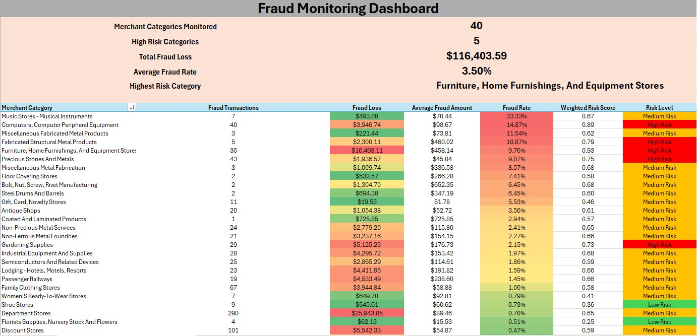
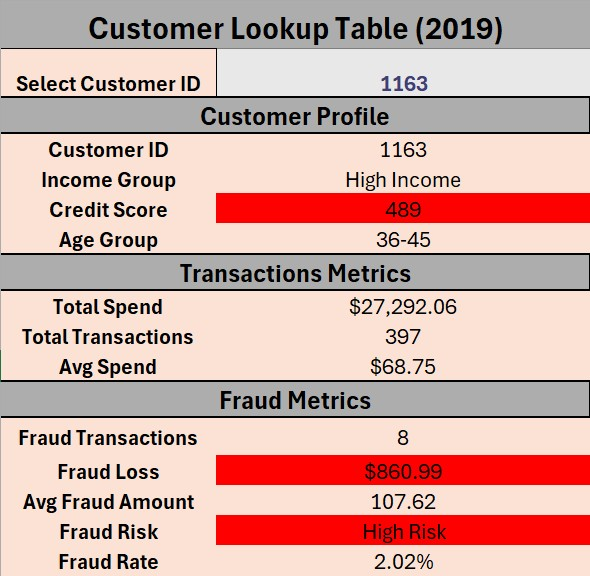
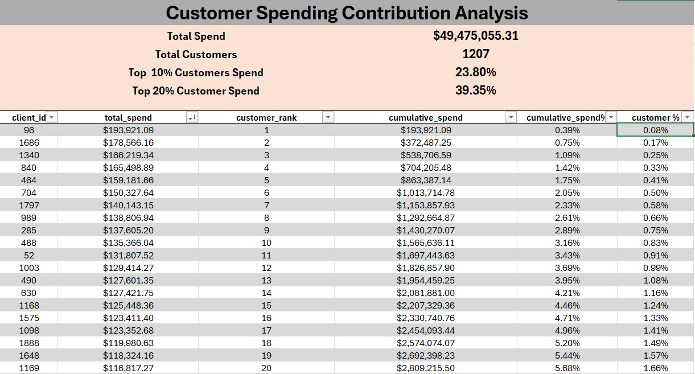
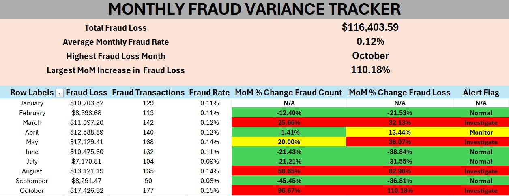
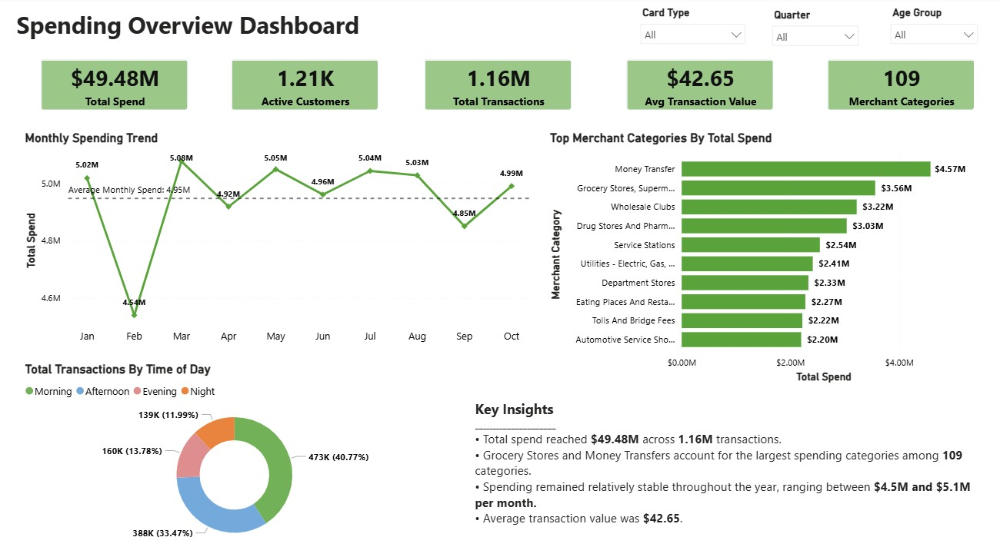
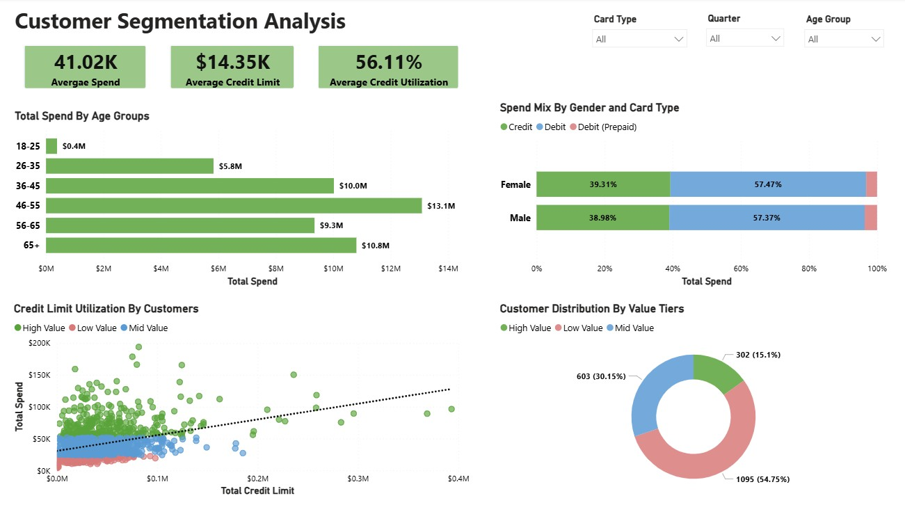
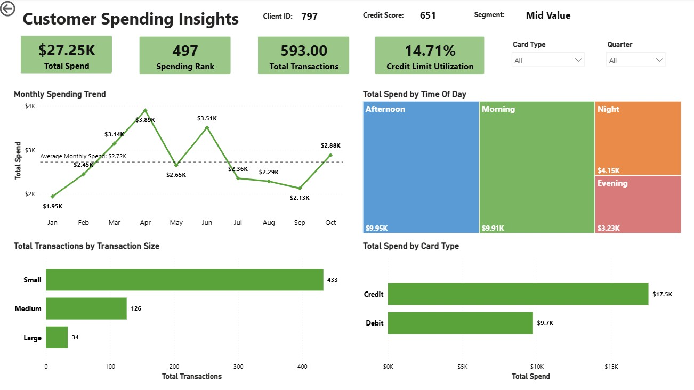
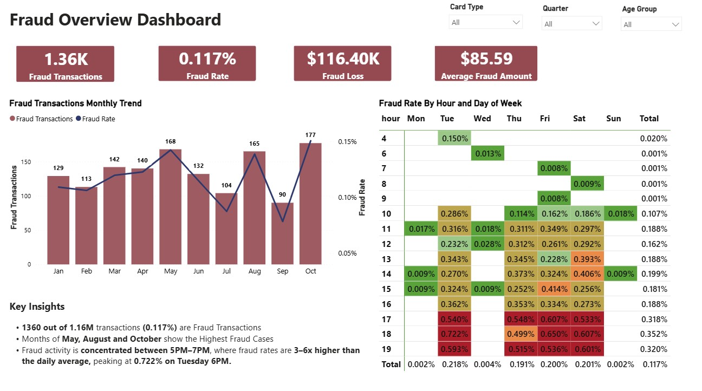
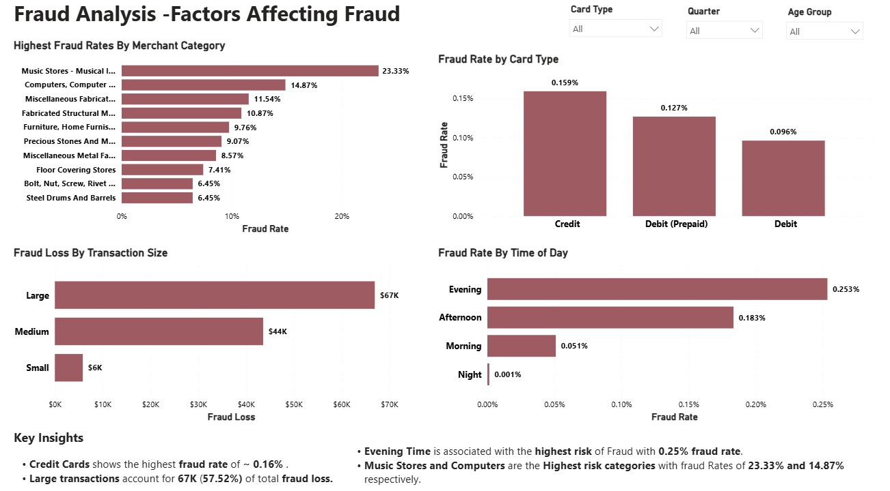
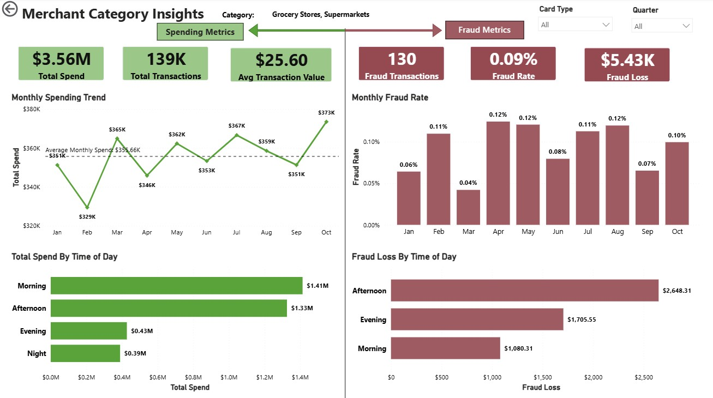

# 💳 Financial Transactions Spend Analysis & Fraud Risk Assessment
### End-to-End Analytics Solution in Excel & Power BI

**By Vishal Agrawal | June 2026**

---

## 📌 Project Overview

This project transforms a large-scale financial transactions dataset into a portfolio-grade, end-to-end analytics solution. Using **1.16 million transactions** from 2019 across ~2,000 customers, 6,000 payment cards, and 109 merchant categories, the project covers the complete analytics lifecycle — from raw data ingestion and feature engineering to interactive dashboard development and statistical hypothesis testing.

Two analytical tracks were built in parallel:
- **Spending Overview & Customer Segmentation** — spending patterns, demographic trends, card usage, and customer value tiers
- **Fraud Monitoring & Risk Analysis** — fraud exposure, high-risk merchant categories, transaction anomalies, and temporal fraud hotspots

---

## 🗂️ Dataset

**Source:** [Financial Transaction Dataset — Kaggle](https://www.kaggle.com/)

| File | Rows | Description |
|---|---|---|
| `transactions_data.csv` | 13.3M | Transaction-level records (2010–2019) |
| `users_data.csv` | 2,000 | Customer demographics and credit characteristics |
| `cards_data.csv` | 6,000 | Card attributes and credit limits |
| `mcc_codes.json` | 109 | Merchant Category Code descriptions |
| `train_fraud_labels.json` | 8.9M | Fraud labels per transaction |

Dataset was filtered to **2019 only** (~1.16M transactions) for a focused reporting period.

---

## 🛠️ Tools & Technologies

| Layer | Tools Used |
|---|---|
| Data Preparation | Python (Pandas) |
| Spreadsheet Analysis | Excel — Pivot Tables, XLOOKUP, IFS/SUMIF/COUNTIF, Data Validation, Conditional Formatting, Data Analysis ToolPak |
| Multidimensional Modeling | Power Pivot — Star Schema, DAX Measures, KPI Metrics, Interactive Slicers, Matrix Analysis |
| BI Dashboards | Power BI — DAX, Time Intelligence, Drill-Through, Drill-Down, Treemaps, Scatter Plots, Heatmaps, Dynamic Tooltips |
| Statistical Testing | Welch's t-Test, Pearson Chi-Square Test |

---

## ⚙️ Python Data Preparation

The raw source files required substantial preprocessing before analysis. Key activities:

- **Preprocessing:** Filtered 13.3M transactions down to 1.16M (2019); extracted and structured fraud labels and MCC codes from JSON; validated fraud label coverage (67% of transactions labeled)
- **Cleaning:** Standardized currency strings and timestamps; resolved missing values; classified unlabeled transactions as "Unknown" rather than "Legitimate" to avoid bias; retained negative amounts as legitimate refunds
- **Feature Engineering:**
  - *Transaction:* Amount Bucket (Small/Medium/Large), Time of Day, Fraud Flag
  - *Customer:* Age Group, Income Group, Customer Spend Tier
  - *Card:* Card Age, Card Age Group
- **Dimensional Modeling:** Structured output into a **star schema** — one fact table + three dimension tables — optimized for Excel and Power BI

---

## 📊 Excel Analysis

Since the 1.16M-row fact table exceeds Excel's row limit, the data was pre-aggregated in Python into customer-level, monthly, and merchant-level datasets. A 100K-transaction sample was drawn for hypothesis testing.

### 4.1 — Fraud Monitoring Dashboard
**Objective:** Rank merchant categories by fraud risk using a weighted score combining fraud rate and total fraud loss.



**Key Findings:**
- Computers & Peripheral Equipment, Furniture & Home Furnishings, and Fabricated Structural Metal Products had the highest weighted risk scores
- Categories like Artist Supply Stores and Motor Freight Carriers showed consistently low fraud rates and losses
- The weighted risk score framework prevents over-reliance on either frequency or monetary impact alone

---

### 4.2 — Customer Risk Lookup Tool
**Objective:** Self-service lookup tool for instant retrieval of customer demographics, spend behavior, credit characteristics, and fraud history.



**Key Findings:**
- Consolidates customer profile, transaction metrics, and fraud metrics into a single dynamic view driven by Data Validation (dropdown)
- Conditional formatting highlights low credit scores, elevated fraud losses, and high-risk classifications in red
- Eliminates manual cross-dataset searches — supports rapid first-level investigation

---

### 4.3 — Customer Spend Pareto Analysis
**Objective:** Determine whether spending is concentrated among a small share of customers (classical Pareto pattern).



**Key Findings:**
- Total spend of **$49.5M** across 1,207 customers; top 10% contributed **23.8%** (~$11.8M); top 20% contributed **39.35%** (~$19.5M)
- The Lorenz curve shape shows **spending is spread relatively evenly** — no sharp elite-driven concentration
- Highest single customer (Client 96, $193,921) represents only **0.39% of total spend** — no material revenue dependency risk
- Fraud loss is similarly diffuse → broad transactional monitoring is more appropriate than VIP-account surveillance

---

### 4.4 — Monthly Fraud Variance Tracker
**Objective:** Track MoM volatility in fraud losses and transaction volume; trigger tiered investigative alerts based on predefined thresholds.



**Key Findings:**
- October's fraud loss surged **110.18% MoM**, accompanied by a 96.67% jump in fraud count — indicates a coordinated fraud event
- August showed disproportionate impact: **82.98% loss surge** vs. 58.65% count growth → higher average loss per fraud transaction
- September was the natural control point: fraud count fell 45.45% and fraud loss fell 36.81%
- Alert Flag framework (Normal / Monitor / Investigate) correctly distinguishes signal from noise

---

### 4.5 — Hypothesis Testing

#### Test 1: Do fraudulent transactions involve larger amounts than legitimate ones?
**Method:** Welch's Two-Sample t-Test (Excel Data Analysis ToolPak)

| Metric | Value |
|---|---|
| Mean — Legitimate | $96.35 |
| Mean — Fraudulent | $42.81 |
| p-Value (two-tailed) | 0.00039 |

**Conclusion:** Null hypothesis rejected (p < 0.05). Fraudulent transactions are, on average, more than **twice as large** as legitimate ones. Transaction amount is a **statistically viable feature** for fraud detection models.

---

#### Test 2: Does fraud rate differ across customer income groups?
**Method:** Pearson Chi-Square Test of Independence (CHISQ.TEST in Excel)

| Income Group | Observed Fraud | Expected Fraud | Chi-Square Contribution |
|---|---|---|---|
| High Income | 17 | 23.06 | 1.59 |
| Low Income | 33 | 20.13 | **8.23** |
| Lower Middle | 43 | 53.71 | 2.14 |
| Upper Middle | 31 | 27.10 | 0.56 |

**p-Value: 0.00574**

**Conclusion:** Fraud is **not independent of income group** (p < 0.05). Low Income customers drove the result most forcefully — observed fraud was 64% above expectation. High Income customers were underrepresented in fraud relative to expectation.

---

### 4.6 — Power Pivot Analysis

Power Pivot loaded the full **1.16M-row** fact table into the Excel Data Model using a star schema. DAX measures enabled cross-dimensional fraud and spending analysis without pre-aggregation.

**DAX Measures:**
```
Total Spend := SUM(fact_transactions[amount])
Fraud Rate := DIVIDE([Fraud Transactions], [Total Transactions])
Fraud Loss := CALCULATE(SUM(fact_transactions[amount]), fact_transactions[fraud_flag] = 1)
```

**Customer Segment Fraud Risk Matrix:**
- Fraud exposure varied significantly — not uniformly distributed across the customer base
- Poor and Fair credit score customers showed higher fraud rates, particularly within High Income segments
- Customers with Good credit scores generated the **largest total fraud losses** despite not having the highest fraud rates → importance of evaluating both frequency and monetary impact

**Customer Segment Spending Matrix:**
- Customers aged **46–55** generated the highest total spend across most income groups
- Lower Middle Income customers contributed the largest share of total spending (peak: **$5.18M** in the 46–55 group)
- High Income customers had the highest average transaction values ($50–$77 per transaction)

---

## 📈 Power BI Dashboards

Six interconnected dashboards were developed using a dimensional star schema in Power BI.

**Key DAX Measures:**
```
MoM Spend Growth % = DIVIDE([Total Spend] - [Previous Month Spend], [Previous Month Spend])
Customer Spend Rank = RANKX(ALL(dim_users[client_id]), [Total Spend], , DESC, DENSE)
MoM Fraud Rate Change (pp) = VAR PrevMonthRate = [Previous Month Fraud Rate]
    RETURN IF(ISBLANK(PrevMonthRate), BLANK(), ([Fraud Rate] - PrevMonthRate) * 100)
```

---

### Dashboard 1 — Spending Overview



- **$49.48M** total spend across **1.16M** transactions from **1,210** unique customers
- Monthly spend was stable ($4.5M–$5.1M range) — limited seasonality
- **Money Transfer** was the top merchant category (~$4.5M); Grocery Stores, Drug Stores, and Utilities followed
- Interactive slicers: Card Type, Quarter, Age Group

---

### Dashboard 2 — Customer Segmentation



- Customers aged **46–55** generated the highest spend ($13.1M), followed by 65+ ($10.8M)
- **Low Value customers** dominated the base (54.75%); High Value customers represented only **15.1%** but drove a disproportionate share of spend
- Debit cards accounted for **~57%** of spending across both genders; Credit cards ~39%
- Credit utilization scatter shows positive relationship between credit limit and total spend

---

### Dashboard 3 — Customer Insights (Drill-Through)



- Customer-level drill-through view: spend rank, credit utilization, monthly trend, transaction size breakdown, card type split, and time-of-day analysis
- Example: Client 797 — $27.25K spend, 593 transactions, 497th rank, Mid Value segment
- 73% of transactions were small-value; Afternoon + Morning periods accounted for 73% of spend
- Allows targeted profiling of any customer directly from the segmentation dashboard

---

### Dashboard 4 — Fraud Overview



- Only **1,360 of 1.16M transactions** were fraudulent — **0.117%** fraud rate, **$116.4K** total loss
- October, May, and August recorded the highest fraud case volumes
- Fraud was heavily concentrated in **late afternoon/evening (5–7 PM)**, with rates exceeding **0.5%**
- Peak fraud hotspot: **Tuesday 6 PM at 0.722%** — more than 6× the overall average
- Fraud rate by hour × day-of-week heatmap enables precise temporal targeting

---

### Dashboard 5 — Fraud Analysis



- **Music Stores – Musical Instruments: 23.33% fraud rate** (highest); Computers & Peripherals: 14.87%
- Credit cards had the highest fraud rate (**0.159%**) vs. 0.096% for standard Debit — ~66% riskier
- **Large transactions generated $67K (57.5%) of total fraud loss** despite being least frequent
- Evening transactions recorded the highest time-of-day fraud rate (0.253%)

---

### Dashboard 6 — Merchant Insights (Drill-Through)



- Merchant-level drill-through combining spending performance and fraud exposure in a dual-section layout
- Example: Grocery Stores & Supermarkets — $3.56M spend, 139K transactions, 0.09% fraud rate
- Monthly fraud rate heatmap highlights periodic spikes even in low-risk categories
- Afternoon transactions produced the **largest fraud losses** ($2.65K) despite Morning driving the highest spending volume — fraud risk ≠ transaction volume

---

## 📋 Summary of Key Insights

| Domain | Insight |
|---|---|
| Spending | $49.5M in total spend; 46–55 age group is the highest-value cohort |
| Customers | High Value customers (15.1%) drive disproportionate spend; 54.75% are Low Value |
| Fraud Rate | 0.117% overall; Music Stores (23.33%) and Computer Stores (14.87%) are extreme outliers |
| Fraud Timing | Tuesday 6 PM fraud rate: 0.722% — 6× the average |
| Fraud by Size | Large transactions = 57.5% of total fraud loss |
| Fraud by Card | Credit cards 66% riskier than Debit cards |
| Statistical | Fraud transactions are 2× larger in mean amount (p = 0.00039); Low Income customers 64% over-represented in fraud (p = 0.00574) |

---

## 💡 Business Recommendations

1. **Enhanced controls for high-risk merchant categories** — implement additional verification for Music Stores, Computer Equipment, and Fabricated Metal Products
2. **Risk-based screening for large transactions** — large-value purchases drive 57.5% of fraud losses despite lower volume
3. **Increased fraud surveillance during 5–7 PM**, particularly on Tuesdays
4. **Targeted retention strategies for High Value customers** — small cohort (15.1%) with disproportionate revenue contribution
5. **Income-segmented fraud monitoring** — Low Income customers are statistically over-represented in fraud; targeted intervention yields highest marginal return
6. **Dynamic fraud scoring model** combining merchant category + transaction amount + payment method + transaction timing

---

## 📁 Repository Structure

```
├── python/
│   ├── Data_Cleaning_and_Feature_Engineering.ipynb
│   └── Data_Filtering.py
├── excel/
│   └── Financial_Transactions_Analysis.xlsx
├── powerbi/
│   └── Financial_Transactions_Dashboard.pbix  # Excluded from repository (size limit)
├── data/
│   ├── fact_transactions.csv                  # Excluded from repository (1.16M rows)
│   ├── dim_users.csv
│   ├── dim_cards.csv
│   └── dim_mcc.csv
├── images/
│   ├── excel_fraud_monitoring.png
│   ├── excel_customer_lookup.png
│   ├── excel_pareto.png
│   ├── excel_variance_tracker.png
│   ├── pbi_spending_overview.png
│   ├── pbi_customer_segmentation.png
│   ├── pbi_customer_insights.png
│   ├── pbi_fraud_overview.png
│   ├── pbi_fraud_analysis.png
│   └── pbi_merchant_insights.png
├── reports/
│  ├── Financial_Transactions_Analysis.pdf
└── README.md
```

---

## 👤 Author

**Vishal Agrawal**
[LinkedIn](#) · [GitHub](#) · [Portfolio](#)
